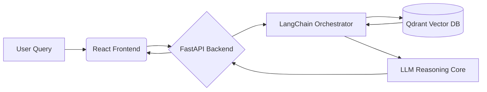

# UniMelb AI Course Advisor (Reflexive RAG Agent)

An intelligent academic planning assistant that navigates complex degree prerequisites using a Reflexive Retrieval-Augmented Generation (RAG) architecture.

## Context & Problem Statement

University handbooks are dense, and prerequisite chains (e.g., Calculus 2 -> Vector Calculus -> Real Analysis) are difficult to visualize mentally. Students often make planning errors that delay graduation due to overlooked constraints.

This project implements a Reflexive RAG Agent designed to:
*   **Ingest unstructured handbook data.**
*   **Retrieve relevant subject clauses** using semantic search (Qdrant).
*   **Reflect on retrieval quality** to minimize hallucination.
*   **Reason about logic chains** to validate study plans deterministically.

## Architecture

The system follows a decoupled architecture separating the reasoning engine from the interface.



*   **Ingestion Pipeline (`ingest.py`):** Specialized pre-processing of handbook text chunks to maximize retrieval density.
*   **Vector Store:** Qdrant used for high-speed similarity search.
*   **Reflexive Loop:** The LLM evaluates its own retrieved context before generating an answer. If context is insufficient, it signals uncertainty rather than fabricating prerequisites.

## Tech Stack

*   **Backend:** Python, FastAPI, Uvicorn
*   **AI/ML:** LangChain, OpenAI API (GPT-4o), Qdrant (Vector Store)
*   **Frontend:** React.js, Vite, TailwindCSS
*   **DevOps:** Docker (planned), Git

## Setup & Execution

**Prerequisites:** Python 3.10+, Node.js 18+, OpenAI API Key.

### 1. Backend Setup

```bash
cd backend
python -m venv venv
source venv/bin/activate  # or venv\Scripts\activate on Windows
pip install -r requirements.txt

# Configure Environment
echo "OPENAI_API_KEY=your_key_here" > .env

# Run Ingestion (First time only)
python ../ingest.py

# Start Server
uvicorn main:app --reload
```

### 2. Frontend Setup

```bash
cd frontend
npm install
npm run dev
```

## Future Roadmap

*   **GraphRAG Implementation:** Migrating from vector-only retrieval to a Knowledge Graph (Neo4j) to explicitly model cyclic prerequisites.
*   **Multi-Turn Memory:** Enhancing chat history management for complex, multi-semester planning sessions.

## Author

**Zishan (Shannon) Chen**